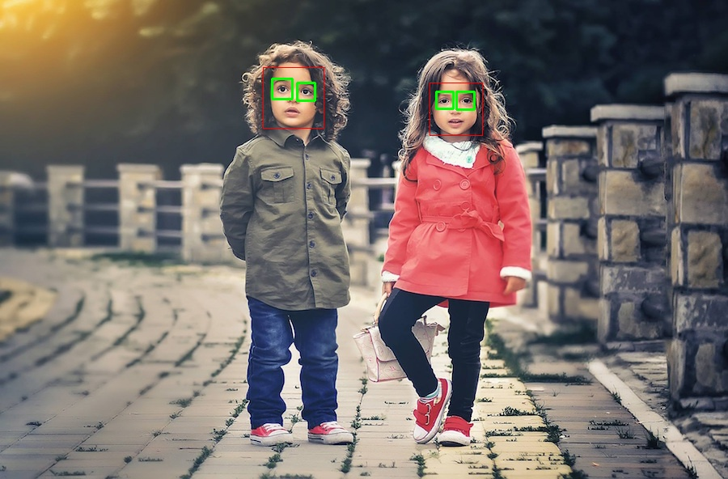

# Computer Vision Essentials

- [Computer Vision Essentials](#computer-vision-essentials)
  - [Introduction](#introduction)
  - [Used Libraries/Packages](#used-librariespackages)
  - [How To Run](#how-to-run)
  - [Usage](#usage)
  - [Support](#support)
  - [Roadmap](#roadmap)
  - [Contributing](#contributing)
  - [Authors and acknowledgment](#authors-and-acknowledgment)
  - [License](#license)
  - [Citation](#citation)
  - [Author](#author)
  - [Extra Downloads](#extra-downloads)

## Introduction

According to [wikipedia](https://en.wikipedia.org/wiki/Computer_vision, "computer_vision-Wikipedia") -

Computer vision is an interdisciplinary scientific field that deals with how computers can gain high-level understanding from digital images or videos. From the perspective of engineering, it seeks to understand and automate tasks that the human visual system can do.

Computer vision tasks include methods for acquiring, processing, analyzing and understanding digital images, and extraction of high-dimensional data from the real world in order to produce numerical or symbolic information, e.g. in the forms of decisions.

[Read More ...](https://en.wikipedia.org/wiki/Computer_vision, "computer_vision-Wikipedia")

## Used Libraries/Packages

- **OpenCV** - OpenCV (Open Source Computer Vision Library) is an open source computer vision and machine learning software library.
- **PixelLib** - PixelLib is a library created for performing image and video segmentation using few lines of code.
- **CVLib** - A simple, high level, easy-to-use open source Computer Vision library for Python.
- **Dlib** - Dlib is a general purpose cross-platform software library written in the programming language C++.
- **PIL/Pillow** - Python Imaging Library is a free and open-source additional library for the Python programming language that adds support for opening, manipulating, and saving many different image file formats
- **Keras** - Keras is the most used deep learning framework among top-5 winning teams on Kaggle.
- **Tensorflow** - TensorFlow is a free and open-source software library for machine learning.
- **Pytessarct** - Python-tesseract is an optical character recognition (OCR) tool for python. That is, it will recognize and “read” the text embedded in images.
- **scikit-image** - scikit-image is an open-source image processing library for the Python programming language. It includes algorithms for segmentation, geometric transformations, color space manipulation, analysis, filtering, morphology, feature detection, and more.
- **Matplotlib** - Matplotlib is a cross-platform, data visualization and graphical plotting library for Python and its numerical extension NumPy.

## How To Run

- Install python 3.6+

Create virtual envionment with `pipenv`.

```bash
python -m pip install pipenv
pipenv install -r requirements.txt
pipenv shell
```

NOTE- check the [guide](https://www.tensorflow.org/install) for tenosflow installation for your CPU/GPU. for using tensorflow-gpu install the CUDA-11.0 and necessary libraries.

Large models and files hosted on google drive. **For downloading them run [utils.py](utils.py)**

```bash
python utils.py
```

## Usage

Computer vision allows the computer to perform the same kind of tasks as humans with the same efficiency. There are a two main task which are defined below:

- Object Classification - In the object classification, we train a model on a dataset of particular objects, and the model classifies new objects as belonging to one or more of your training categories.
- Object Identification - In the object identification, our model will identify a particular instance of an object - for example, parsing two faces in an image and tagging one as Virat Kohli and other one as Rohit Sharma.



## Support

contributers

## Roadmap


## Contributing

Before submitting a bug, please do the following:

Perform basic troubleshooting steps:

- Make sure you are on the latest version. If you are not on the most recent version, your problem may have been solved already! Upgrading is always the best first step.
- Try older versions. If you are already on the latest release, try rolling back a few minor versions (e.g. if on 1.7, try 1.5 or 1.6) and see if the problem goes away. This will help the devs narrow down when the problem first arose in the commit log.
- Try switching up dependency versions. If the software in question has dependencies (other libraries, etc) try upgrading/downgrading those as well.

## Authors and acknowledgment

- [Deepak Raj](https://github.com/codePerfectPlus)
- [Pranjalmishra30](https://github.com/Pranjalmishra30)
- [GloriousMusketeer](https://github.com/GloriousMusketeer)
- [bislara](https://github.com/bislara)
- [its-harshil](https://github.com/its-harshil)
- [farhan0syakir](https://github.com/farhan0syakir)
- [harshit-saraswat](https://github.com/harshit-saraswat)
- [...](https://github.com/codePerfectPlus/OpenCv-tutorial/graphs/contributors)

## License

For open source projects,Under MIT License.

## Citation

```
Stéfan van der Walt, Johannes L. Schönberger, Juan Nunez-Iglesias, François Boulogne, Joshua D. Warner, Neil Yager, Emmanuelle Gouillart, Tony Yu and the scikit-image contributors. scikit-image: Image processing in Python. PeerJ 2:e453 (2014) https://doi.org/10.7717/peerj.453

Coelho, L.P. 2013. Mahotas: Open source software for scriptable computer vision. Journal of Open Research Software 1(1):e3, DOI: http://dx.doi.org/10.5334/jors.ac
```

## Author

- Project : Computer Vision Essentials
- Language : Python
- Github : <https://github.com/codePerfectPlus>
- Website : <http://codeperfectplus.herokuapp.com>

## Extra Downloads

1. FaceDetection Caffee Models